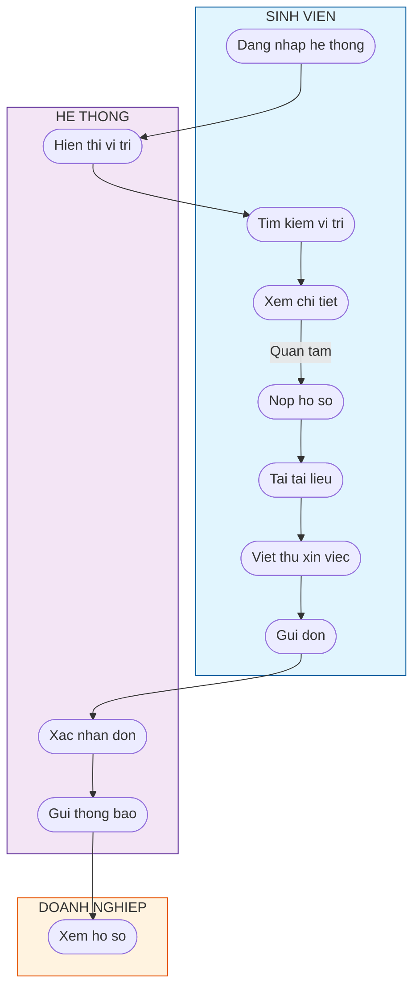
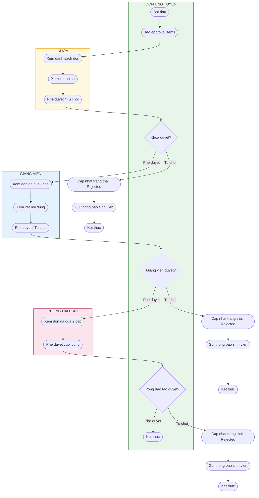
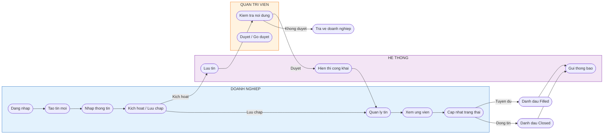
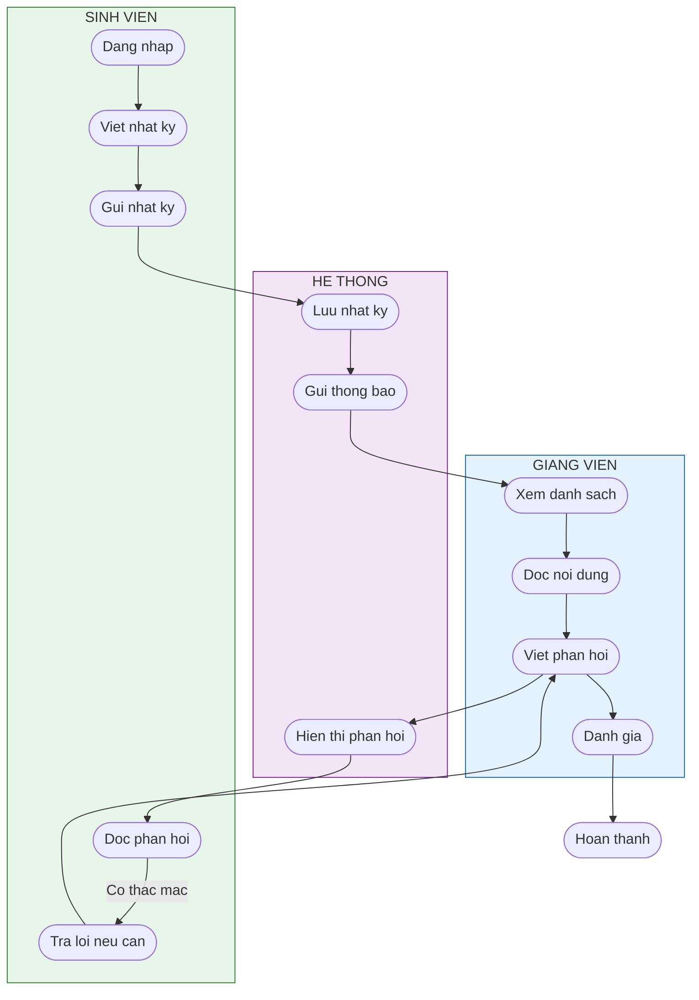
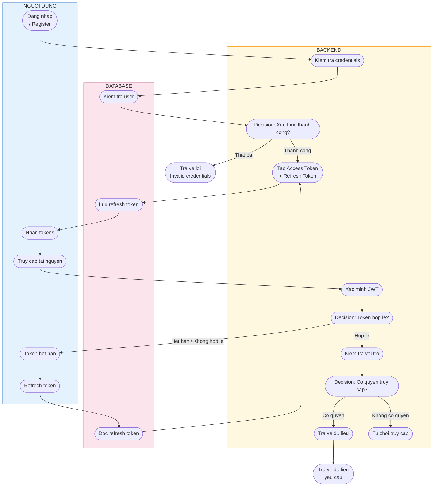

# BAI TAP LON: Sơ đồ Hoat động (Activity Diagram)

**Hệ thống:** InternHub - Quản lý Thực tập  
**Môn học:** Phân tích và Thiết kế Hệ thống Thông tin  
**Ngày:** 13/05/2026

---

## I. Danh sách Thành viên

| STT | Họ và Tên | Vai trò | Phân công |
|-----|-----------|---------|-----------|
| 1 | [Thành viên 1] | Nhóm trưởng | Thiết kế quy trình 1, 2, tổng hợp |
| 2 | [Thành viên 2] | Thành viên | Thiết kế quy trình 3, 4 |
| 3 | [Thành viên 3] | Thành viên | Thiết kế quy trình 5, 6 |
| 4 | [Thành viên 4] | Thành viên | Kiểm tra, soạn mô tả text |

> **Ghi chú:** Vui lòng cập nhật tên thật của các thành viên trước khi nộp.

---

## II. Mô tả Quy trình Nghiệp vụ bằng Text

### Quy trình 1: Quy trình Ứng tuyển Thực tập

**Tên quy trình:** Quy trình ứng tuyển thực tập  
**Tác nhân chính:** Sinh viên  
**Tác nhân phụ:** Hệ thống, Doanh nghiệp  
**Mô tả:** Mô tả các bước sinh viên thực hiện để tìm kiếm và ứng tuyển vị trí thực tập phù hợp trên hệ thống InternHub.

**Các bước thực hiện:**

1. **Đăng nhập hệ thống:** Sinh viên truy cập trang đăng nhập, nhập email và mật khẩu. Hệ thống xác thực thông tin đăng nhập.

2. **Truy cập trang vị trí thực tập:** Sau khi đăng nhập thành công, sinh viên được chuyển hướng đến trang danh sách vị trí thực tập.

3. **Tìm kiếm và lọc vị trí:** Sinh viên sử dụng thanh tìm kiếm và bộ lọc (theo lĩnh vực, địa điểm, loại công việc) để tìm vị trí phù hợp.

4. **Xem chi tiết vị trí:** Sinh viên nhấp vào vị trí quan tâm để xem thông tin chi tiết bao gồm mô tả công việc, yêu cầu, quyền lợi.

5. **Nộp hồ sơ ứng tuyển:** Sinh viên nhấp nút "Apply Now" để bắt đầu quy trình nộp đơn.

6. **Tải lên tài liệu:** Sinh viên tải lên các tài liệu bắt buộc (resume) và tùy chọn (thư xin việc, portfolio, transcript).

7. **Viết thư xin việc:** Sinh viên nhập nội dung thư xin việc vào form.

8. **Xác nhận và gửi đơn:** Sinh viên kiểm tra thông tin đã nhập, xác nhận và gửi đơn ứng tuyển.

9. **Nhận thông báo:** Hệ thống gửi thông báo xác nhận đã nhận đơn và cập nhật trạng thái đơn thành "Applied".

---

### Quy trình 2: Quy trình Phê duyệt Đơn Ứng tuyển

**Tên quy trình:** Quy trình phê duyệt đơn ứng tuyển đa cấp  
**Tác nhân chính:** Khoa, Giảng viên, Phòng Đào tạo  
**Tác nhân phụ:** Hệ thống, Sinh viên  
**Mô tả:** Mô tả quy trình phê duyệt đơn ứng tuyển thực tập qua nhiều cấp độ: Khoa, Giảng viên, và Phòng Đào tạo.

**Các bước thực hiện:**

1. **Tiếp nhận đơn:** Khi sinh viên nộp đơn, hệ thống tự động tạo các approval items cho từng cấp duyệt.

2. **Duyệt cấp Khoa:** Người phụ trách khoa đăng nhập, xem danh sách đơn chờ duyệt cấp khoa. Xem xét hồ sơ sinh viên và quyết định: Phê duyệt hoặc Từ chối kèm lý do.

3. **Kiểm tra kết quả cấp khoa:**
   - Nếu Từ chối: Cập nhật trạng thái đơn thành "Rejected", gửi thông báo cho sinh viên.
   - Nếu Phê duyệt: Chuyển đơn sang cấp Giảng viên duyệt.

4. **Duyệt cấp Giảng viên:** Giảng viên được phân công đăng nhập, xem đơn đã qua khoa duyệt. Xem xét nội dung và quyết định: Phê duyệt hoặc Từ chối kèm nhận xét.

5. **Kiểm tra kết quả cấp giảng viên:**
   - Nếu Từ chối: Cập nhật trạng thái đơn thành "Rejected", gửi thông báo cho sinh viên.
   - Nếu Phê duyệt: Chuyển đơn sang cấp Phòng Đào tạo.

6. **Duyệt cấp Phòng Đào tạo:** Phòng đào tạo xem xét đơn đã qua 2 cấp. Thực hiện phê duyệt cuối cùng.

7. **Hoàn thành quy trình:** Nếu Phòng Đào tạo phê duyệt, trạng thái đơn chuyển thành "Approved". Hệ thống gửi thông báo chúc mừng cho sinh viên và cập nhật dashboard của doanh nghiệp.

---

### Quy trình 3: Quy trình Quản lý Tin Tuyển dụng

**Tên quy trình:** Quy trình đăng tin và quản lý tuyển dụng  
**Tác nhân chính:** Doanh nghiệp  
**Tác nhân phụ:** Quản trị viên, Sinh viên  
**Mô tả:** Mô tả quy trình doanh nghiệp tạo, đăng tin tuyển dụng và quản lý các ứng viên.

**Các bước thực hiện:**

1. **Đăng nhập:** Doanh nghiệp đăng nhập vào hệ thống với tài khoản đã được xác thực.

2. **Truy cập trang quản lý tin:** Doanh nghiệp chọn mục "Quản lý tin tuyển dụng" trên dashboard.

3. **Tạo tin tuyển dụng mới:** Doanh nghiệp nhấp nút "Tạo tin mới" và điền thông tin:
   - Tiêu đề vị trí
   - Lĩnh vực, địa điểm
   - Mô tả công việc
   - Yêu cầu ứng viên
   - Quyền lợi
   - Lương, thời gian, loại hình (remote/hybrid/onsite)
   - Số lượng tuyển

4. **Lưu nháp hoặc kích hoạt:** Doanh nghiệp chọn "Lưu nháp" để chỉnh sửa sau hoặc "Kích hoạt" để đăng tin ngay.

5. **Quản lý tin đã đăng:** Doanh nghiệp xem danh sách tin, có thể:
   - Chỉnh sửa thông tin tin
   - Tạm dừng tin (Paused)
   - Đóng tin (Closed)
   - Xóa tin (nếu chưa có ứng viên)

6. **Xem và xử lý ứng viên:** Doanh nghiệp chọn "Xem ứng viên" để xem danh sách sinh viên đã ứng tuyển, tải tài liệu, cập nhật trạng thái (Screening, Interview, Offer).

7. **Đánh giá ứng viên:** Doanh nghiệp thực hiện đánh giá 360 độ đối với các intern đang làm việc.

8. **Hoàn thành tuyển dụng:** Khi vị trí đã tuyển đủ, doanh nghiệp đánh dấu tin thành "Filled".

---

### Quy trình 4: Quy trình Viết Nhật ký Thực tập

**Tên quy trình:** Quy trình theo dõi và đánh giá nhật ký thực tập  
**Tác nhân chính:** Sinh viên, Giảng viên  
**Tác nhân phụ:** Hệ thống  
**Mô tả:** Mô tả quy trình sinh viên viết nhật ký hàng tuần và giảng viên theo dõi, phản hồi.

**Các bước thực hiện:**

1. **Truy cập trang nhật ký:** Sinh viên đăng nhập và chọn mục "Nhật ký thực tập" trên dashboard.

2. **Viết nhật ký tuần mới:** Sinh viên chọn tuần cần viết và điền các thông tin:
   - Tuần thứ mấy
   - Công việc đã hoàn thành
   - Thách thức đã gặp
   - Bài học rút ra được
   - Mục tiêu cho tuần tới

3. **Gửi nhật ký:** Sinh viên nhấp nút "Gửi" để nộp nhật ký. Trạng thái chuyển thành "Pending".

4. **Giảng viên xem nhật ký:** Giảng viên đăng nhập, truy cập mục "Feedback Hub" hoặc "Phản hồi" để xem danh sách nhật ký chờ duyệt.

5. **Giảng viên phản hồi:** Giảng viên đọc nội dung nhật ký, viết phản hồi, nhận xét và gửi cho sinh viên.

6. **Sinh viên xem phản hồi:** Sinh viên nhận thông báo, đọc phản hồi từ giảng viên, có thể trả lời hoặc đặt câu hỏi.

7. **Giảng viên đánh giá:** Giảng viên đánh giá nhật ký (rating 1-5 sao) và cập nhật trạng thái thành "Reviewed" hoặc "Approved".

8. **Hoàn thành:** Nhật ký được đánh dấu hoàn thành, sinh viên có thể xem lại lịch sử nhật ký.

---

### Quy trình 5: Quy trình Đánh giá Sinh viên

**Tên quy trình:** Quy trình đánh giá năng lực sinh viên thực tập  
**Tác nhân chính:** Giảng viên, Doanh nghiệp, Quản trị viên  
**Tác nhân phụ:** Hệ thống, Sinh viên  
**Mô tả:** Mô tả quy trình các bên liên quan thực hiện đánh giá sinh viên về nhiều tiêu chí khác nhau.

**Các bước thực hiện:**

1. **Chọn loại đánh giá:** Người đánh giá chọn loại đánh giá phù hợp:
   - Giữa kỳ (Midterm)
   - Cuối kỳ (Final)
   - Đánh giá từ Doanh nghiệp (Company)

2. **Chọn sinh viên cần đánh giá:** Người đánh giá chọn sinh viên từ danh sách hoặc tìm kiếm.

3. **Nhập điểm các tiêu chí:** Người đánh giá nhập điểm (thang 1-10) cho các tiêu chí:
   - Điểm kỹ thuật (Technical Score)
   - Điểm thái độ (Attitude Score)
   - Điểm giao tiếp (Communication Score)
   - Điểm làm việc nhóm (Teamwork Score)

4. **Tính điểm tổng:** Hệ thống tự động tính điểm Overall Score là trung bình cộng của các tiêu chí.

5. **Viết nhận xét:** Người đánh giá nhập:
   - Nhận xét chung
   - Điểm mạnh
   - Điểm cần cải thiện

6. **Lưu đánh giá:** Người đánh giá nhấp "Lưu" để lưu đánh giá vào hệ thống.

7. **Gửi thông báo:** Hệ thống gửi thông báo cho sinh viên về đánh giá mới.

8. **Sinh viên xem đánh giá:** Sinh viên đăng nhập, truy cập trang đánh giá để xem chi tiết các điểm số và nhận xét.

---

### Quy trình 6: Quy trình Xác thực và Phân quyền

**Tên quy trình:** Quy trình xác thực người dùng và phân quyền truy cập  
**Tác nhân chính:** Người dùng, Hệ thống  
**Tác nhân phụ:** Không  
**Mô tả:** Mô tả quy trình đăng nhập, xác thực JWT, refresh token và phân quyền dựa trên vai trò người dùng.

**Các bước thực hiện:**

1. **Đăng nhập:** Người dùng truy cập trang `/login`, nhập email và mật khẩu.

2. **Gửi yêu cầu xác thực:** Hệ thống gửi request `POST /auth/login` với credentials.

3. **Xác thực thông tin:** Backend kiểm tra:
   - Email tồn tại trong hệ thống
   - Mật khẩu hash khớp với database

4. **Kiểm tra kết quả xác thực:**
   - Nếu Thất bại: Trả về lỗi "Invalid credentials", hiển thị thông báo cho người dùng.
   - Nếu Thành công: Tiếp tục bước tiếp theo.

5. **Tạo JWT tokens:** Backend tạo:
   - Access Token (hết hạn sau 15 phút)
   - Refresh Token (lưu vào database)

6. **Lưu tokens:** Frontend lưu tokens vào localStorage:
   - `access_token`
   - `refresh_token`
   - `user_data`

7. **Chuyển hướng theo vai trò:** Hệ thống kiểm tra vai trò người dùng và chuyển hướng:
   - Admin → `/admin`
   - Lecturer → `/lecturer`
   - Company → `/company`
   - Student → `/student`

8. **Truy cập tài nguyên:** Người dùng sử dụng Access Token để gọi các API. Backend kiểm tra token và vai trò trước khi cho phép truy cập.

9. **Refresh token (khi cần):** Khi Access Token hết hạn, frontend gửi Refresh Token qua `POST /auth/refresh`. Backend kiểm tra và cấp cặp tokens mới.

---

## III. Sơ đồ Hoat động (Activity Diagrams)

### Sơ đồ 1: Quy trình Ứng tuyển Thực tập



---

### Sơ đồ 2: Quy trình Phê duyệt Đơn Ứng tuyển (Multi-level)



---

### Sơ đồ 3: Quy trình Quản lý Tin Tuyển dụng



---

### Sơ đồ 4: Quy trình Viết Nhật ký Thực tập



---

### Sơ đồ 5: Quy trình Đánh giá Sinh viên

```mermaid
flowchart TB
    %% Swimlanes
    subgraph NGUOI_DANH_GIA["NGUOI DANH GIA\n(Giang vien / Doanh nghiep)"]
        ND1([Chon loai danh gia])
        ND2([Chon sinh vien])
        ND3([Nhap diem ky thuat])
        ND4([Nhap diem thai do])
        ND5([Nhap diem giao tiep])
        ND6([Nhap diem lam viec nhom])
        ND7([Viet nhan xet])
        ND8([Luu danh gia])
    end

    subgraph HE_THONG["HE THONG"]
        HS1([Tinh diem trung binh])
        HS2([Gui thong bao])
        HS3([Luu vao CSDL])
    end

    subgraph SINH_VIEN["SINH VIEN"]
        SV1([Xem danh gia])
        SV2([Doc nhan xet])
    end

    %% Parallel inputs
    par Nhap diem cac tieu chi
        in order
            ND3 --> ND4 --> ND5 --> ND6
        end
    end

    ND2 --> ND3
    ND1 --> ND2

    ND6 --> ND7
    ND7 --> ND8
    ND8 --> HS1

    HS1 --> HS3
    HS3 --> HS2
    HS2 --> SV1
    SV1 --> SV2

    %% Styling
    style NGUOI_DANH_GIA fill:#fff8e1,stroke:#f9a825
    style HE_THONG fill:#f3e5f5,stroke:#7b1fa2
    style SINH_VIEN fill:#e8f5e9,stroke:#2e7d32
```

---

### Sơ đồ 6: Quy trình Xác thực và Phân quyền



---

## IV. Bảng Tổng hợp các Quy trình

| STT | Tên quy trình | Tác nhân chính | Số bước | Ghi chú |
|-----|--------------|-----------------|---------|---------|
| 1 | Ứng tuyển thực tập | Sinh viên | 9 | Có hệ thống thông báo |
| 2 | Phê duyệt đơn ứng tuyển | Khoa, GV, Phòng ĐT | 7 | Quy trình đa cấp |
| 3 | Quản lý tin tuyển dụng | Doanh nghiệp | 8 | Có kiểm duyệt |
| 4 | Viết nhật ký thực tập | Sinh viên, Giảng viên | 8 | Có phản hồi 2 chiều |
| 5 | Đánh giá sinh viên | GV, DN, QTV | 8 | Đánh giá đa tiêu chí |
| 6 | Xác thực & Phân quyền | Người dùng | 9 | JWT + Refresh Token |

---

## V. Ma nguon

- **Frontend:** React + TypeScript + Vite
- **Backend:** NestJS + Prisma ORM
- **Database:** PostgreSQL
- **Auth:** JWT Access Token (15 phút) + Refresh Token

---

> **Ghi chú cuối:** Các sơ đồ trên sử dụng cú pháp Mermaid, có thể render trực tiếp trên GitHub, GitLab, hoặc VS Code (với extension Mermaid). Copy nội dung file Markdown này vào bất kỳ trình preview Mermaid nào để xem đồ thị.
